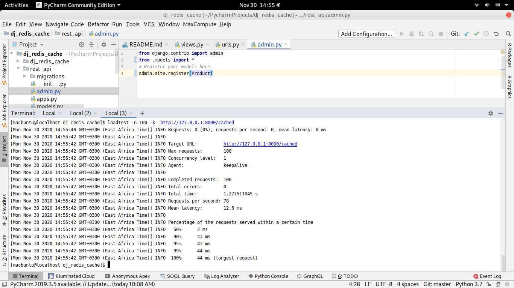

# django-redis-cache
Learning to use redis with Django to cache querysets to increase performance. Packaged and ship with docker
# Tech used
1. Django
2. Django Rest Framework
3. Redis
4. Docker
5. [Loadtest](https://www.npmjs.com/package/loadtest)- Test api performance
6. Django debug toolbar

# Recording the gains using redis
With redis as a cache, the queries are loaded and served faster. Observe the differences below.
## Without caching

**62** requests per second with a total time of 1.602 seconds

## With caching

More requests in lesser time
**78** requests per second in 1.278 seconds
